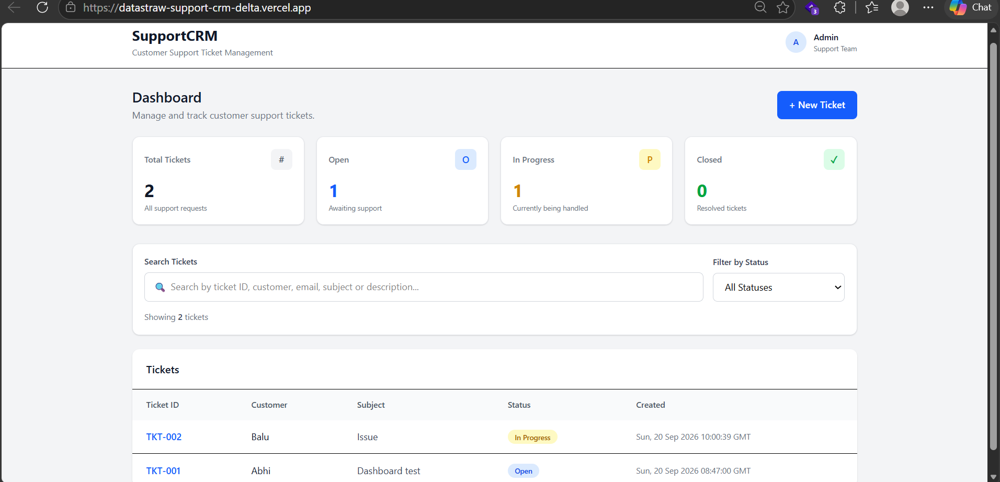

# 🎫 Datastraw Support CRM

### A modern full-stack customer support ticket management system

[](https://datastraw-support-crm-delta.vercel.app/)
[](https://datastraw-support-crm-2.onrender.com/)
[](https://supabase.com/)
[](https://github.com/Shridhanya77/datastraw_support_crm)

> A full-stack Support CRM application built with **React.js, Flask, PostgreSQL and REST APIs**, designed to help support teams create, manage, search and track customer support tickets efficiently.

---

## 🌐 Live Application

### 🚀 Try the application

**Frontend:**  
https://datastraw-support-crm-delta.vercel.app/

**Backend API:**  
https://datastraw-support-crm-2.onrender.com/

**Source Code:**  
https://github.com/Shridhanya77/datastraw_support_crm

---

# 📸 Application Preview

## 🖥️ Dashboard

The dashboard provides an overview of support tickets with statistics, search, status filtering and ticket management.



---

## ➕ Create Ticket

Support agents can create new customer tickets with customer information, issue title and detailed description.


---

## 🎫 Ticket Details

Each ticket has a dedicated details view where support agents can review the issue, update its status and add internal notes.


---

# ✨ Key Features

| Feature | Description |
|---|---|
| 🎫 **Ticket Management** | Create, view, update and delete support tickets |
| 🆔 **Auto Ticket IDs** | Automatically generates unique IDs such as `TKT-001` |
| 🔎 **Smart Search** | Search by customer name, email, ticket ID, subject or description |
| 🏷️ **Status Filtering** | Filter tickets by Open, In Progress or Closed |
| 📝 **Ticket Notes** | Add notes/comments to individual tickets |
| 📊 **Dashboard Statistics** | View total, open, in-progress and closed ticket counts |
| 🔄 **Status Updates** | Change ticket status directly from the ticket details page |
| 🗄️ **PostgreSQL Database** | Persistent cloud database using Supabase |
| 🌍 **Cloud Deployment** | Frontend and backend deployed separately |
| 📱 **Responsive UI** | Clean interface designed for different screen sizes |

---

# 🏗️ System Architecture

```text
                    ┌──────────────────────┐
                    │     React Frontend   │
                    │      Vite + JS       │
                    └──────────┬───────────┘
                               │
                               │ REST API
                               ▼
                    ┌──────────────────────┐
                    │    Flask Backend     │
                    │   Python + CORS      │
                    └──────────┬───────────┘
                               │
                               │ SQL
                               ▼
                    ┌──────────────────────┐
                    │ PostgreSQL Database  │
                    │       Supabase       │
                    └──────────────────────┘


        Deployment

        React Frontend  ───────► Vercel
        Flask Backend   ───────► Render
        PostgreSQL      ───────► Supabase
```

---

# 🛠️ Technology Stack

### Frontend


- React.js
- Vite
- JavaScript
- Tailwind CSS
- Fetch API

### Backend


- Python
- Flask
- Flask-CORS
- Gunicorn
- REST APIs

### Database


- PostgreSQL
- Supabase
- Relational database design

### Deployment & Tools

- Git
- GitHub
- Vercel
- Render
- Supabase
- VS Code
- Postman

---

# 🔌 REST API

| Method | Endpoint | Purpose |
|:---:|---|---|
| `GET` | `/api/tickets` | Retrieve all tickets |
| `GET` | `/api/tickets/<ticket_id>` | Retrieve ticket details and notes |
| `POST` | `/api/tickets` | Create a new ticket |
| `PUT` | `/api/tickets/<ticket_id>` | Update status and add notes |
| `DELETE` | `/api/tickets/<ticket_id>` | Delete a ticket |

### Example Ticket

```json
{
  "ticket_id": "TKT-001",
  "customer_name": "Customer Name",
  "customer_email": "customer@example.com",
  "subject": "Unable to login",
  "description": "Customer is unable to access the account.",
  "status": "Open"
}
```

---

# 🗄️ Database Design

The application uses two related PostgreSQL tables.

### `tickets`

```text
┌─────────────────────────────────┐
│             tickets              │
├─────────────────────────────────┤
│ id                              │
│ ticket_id                       │
│ customer_name                   │
│ customer_email                  │
│ subject                         │
│ description                     │
│ status                          │
│ created_at                      │
│ updated_at                      │
└─────────────────────────────────┘
```

### `notes`

```text
┌──────────────────────────────┐
│            notes             │
├──────────────────────────────┤
│ id                           │
│ ticket_id                    │
│ note_text                    │
│ created_at                   │
└──────────────────────────────┘
```

Each note is associated with its corresponding support ticket.

---

# 📂 Project Structure

```text
datastraw_support_crm/
│
├── 📁 backend/
│   ├── app.py
│   ├── database.py
│   └── requirements.txt
│
├── 📁 frontend/
│   ├── 📁 src/
│   │   ├── App.jsx
│   │   ├── CreateTicket.jsx
│   │   ├── TicketDetails.jsx
│   │   └── services/
│   │       └── api.js
│   │
│   ├── package.json
│   └── vite.config.js
│
├── 📁 Screenshots/
│   ├── dashboard.png
│   ├── create-ticket.png
│   └── ticket-details.png
│
├── .env.example
├── .gitignore
└── README.md
```

---

# 🚀 Running the Project Locally

## 1️⃣ Clone the repository

```bash
git clone https://github.com/Shridhanya77/datastraw_support_crm.git

cd datastraw_support_crm
```

---

## 2️⃣ Start the Backend

```bash
cd backend

python -m venv venv
```

### Windows PowerShell

```powershell
.\venv\Scripts\Activate.ps1
```

Install dependencies:

```bash
pip install -r requirements.txt
```

Start Flask:

```bash
python app.py
```

Backend will run at:

```text
http://127.0.0.1:5000
```

---

## 3️⃣ Start the Frontend

Open another terminal:

```bash
cd frontend
```

Install dependencies:

```bash
npm install
```

Start Vite:

```bash
npm run dev
```

The frontend will be available at the local Vite URL shown in the terminal.

---

# 🔐 Environment Variables

For local PostgreSQL configuration, create a `.env` file and provide:

```text
DATABASE_URL=your_database_connection_string
```

⚠️ **Never commit your real database connection string or credentials to GitHub.**

A safe template is provided in:

```text
.env.example
```

---

# 🧪 Tested Functionality

The deployed application has been tested for the major CRM workflows:

- ✅ Create support ticket
- ✅ Automatic ticket ID generation
- ✅ Ticket listing
- ✅ Ticket details
- ✅ Search tickets
- ✅ Filter by status
- ✅ Update ticket status
- ✅ Add ticket notes
- ✅ Persist notes after refresh
- ✅ Delete tickets
- ✅ Dashboard statistics
- ✅ PostgreSQL persistence
- ✅ Production frontend/backend communication

---

# 🎯 Key Implementation Highlights

### 1. Full-Stack Integration

The application connects a React frontend with a Flask REST API and PostgreSQL database.

### 2. RESTful API Design

Separate API endpoints handle ticket creation, retrieval, updating and deletion.

### 3. Search & Filtering

Users can quickly find tickets using customer information, ticket IDs, descriptions and subjects.

### 4. Persistent Data

Ticket and note information is stored in PostgreSQL through Supabase rather than browser-only storage.

### 5. Production Deployment

The application is deployed using:

```text
GitHub
   │
   ├── Frontend → Vercel
   │
   └── Backend  → Render
                    │
                    ▼
                 Supabase
                 PostgreSQL
```

---

# 📚 What I Learned

Through this project, I gained practical experience in:

- Full-stack web application development
- React component-based architecture
- Flask REST API development
- PostgreSQL database integration
- CRUD operations
- Frontend-backend communication
- Cloud deployment
- Environment variable management
- Git and GitHub workflows
- Debugging production deployment issues

---

# 🔮 Future Improvements

Possible future enhancements include:

- 🔐 User authentication and role-based access
- 📧 Email notifications for ticket updates
- 📎 File attachments
- 📈 Advanced analytics and reporting
- 👥 Customer and support-agent management
- 🔔 Real-time ticket notifications
- 🤖 AI-assisted ticket classification and response suggestions

---

# 👩‍💻 Author

## Shridhanya

**B.E. Computer Science Engineering**

Interested in:

`Full-Stack Development` · `Python` · `AI/ML` · `Data Science` · `Cybersecurity`

### 🔗 Connect

**GitHub:**  
https://github.com/Shridhanya77

---

<div align="center">

### ⭐ If you find this project interesting, consider giving it a star!

**Built with React.js • Flask • PostgreSQL • Supabase**

</div>